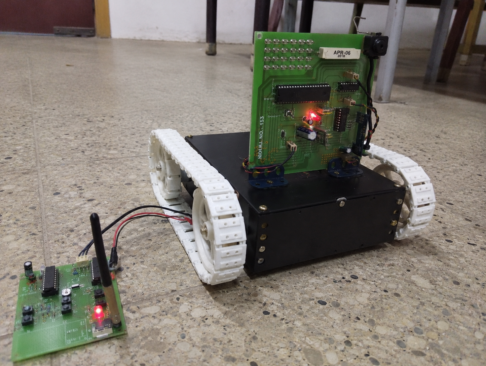
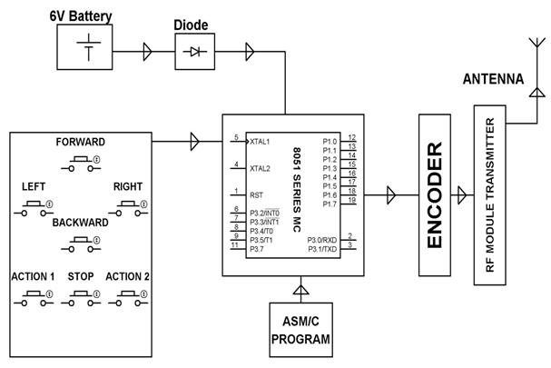
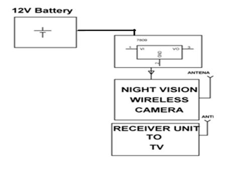
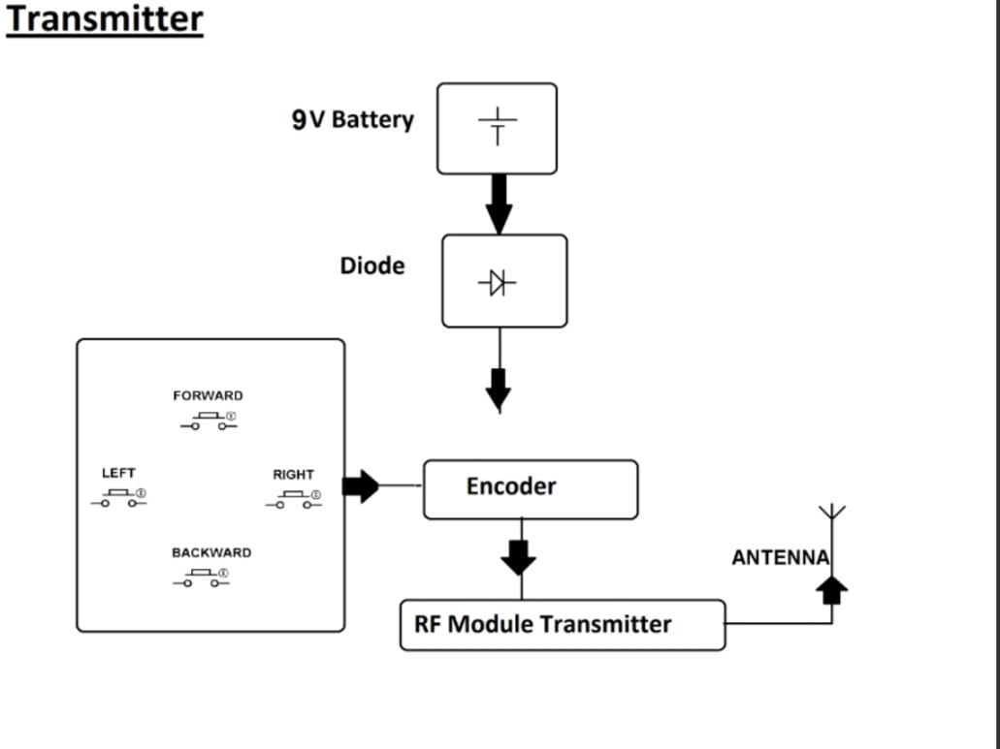

# ESP32-CAM-Based-Wireless-Surveillance-Robot
ESP32-CAM based wireless surveillance robot for monitoring hazardous or war-field-like environments. Uses Arduino, embedded systems, and wireless communication for real-time video streaming and remote navigation, helping reduce human risk and casualties during surveillance operations.
# ESP32-CAM Based Wireless Surveillance Robot

## Overview
An ESP32-CAM based wireless surveillance robot designed for monitoring hazardous or war-field-like environments. The system provides real-time video streaming and remote robot navigation using Arduino, embedded systems, and wireless communication technologies. It helps reduce human risk and casualties during surveillance operations.

---

## Features
- Real-time video streaming
- Wireless robot control
- Remote surveillance and monitoring
- Embedded system implementation
- ESP32-CAM integration
- Helps reduce human involvement in dangerous areas

---

## Components Used
- Arduino UNO
- ESP32-CAM
- Motor Driver Module
- DC Motors
- Robot Chassis
- Battery
- Jumper Wires

---

## Project Setup

. 

---

## Circuit Diagrams

### Main Circuit Diagram

### Battery Connection

### Transmitter Connection

---

## Source Code Files
- `robot_code.ino` → Controls robot movement
- `esp32_cam_code.ino` → Handles ESP32-CAM video streaming

---

## Working Principle
The robot uses Arduino for motor control and ESP32-CAM for wireless live video streaming. The system allows remote monitoring and navigation of the robot in hazardous environments using embedded and wireless communication technologies.

---

## Future Improvements
- Obstacle avoidance system
- Mobile app control
- AI-based object detection
- Night vision camera integration
- Autonomous navigation

---

## Author
Developed as an embedded systems and IoT project for learning robotics, surveillance systems, and wireless communication.
